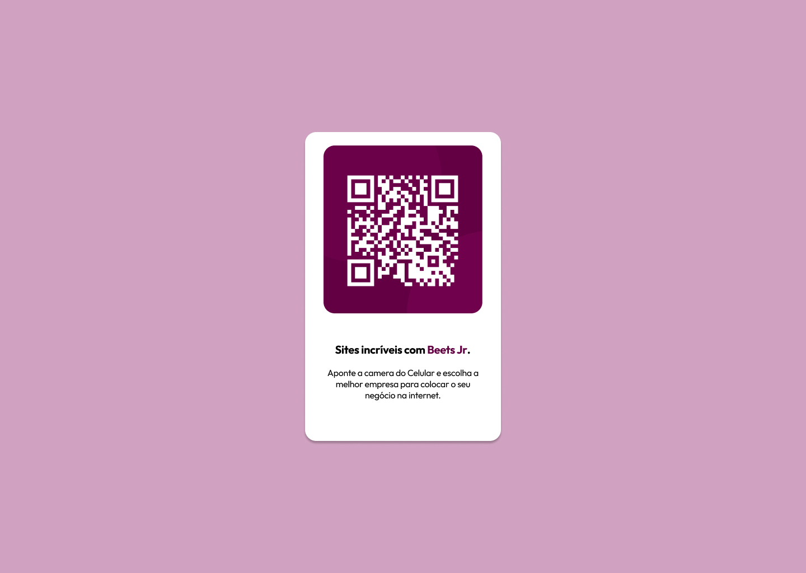

# Desafio 1 - QR Code Component 

## Bem Vindo! 👋

Seja bem vindo, caro explorador, nesta envolvente Jornada pelo QR Code Cósmico. Aqui, suas habilidades serão submetidas a um teste cósmico. Você está preparado para conquistar esse desafio estelar e triunfar sobre todas as adversidades intergalácticas?

## O Desafio

Nesta empolgante jornada, sua missão consistirá em desenvolver um Componente QR Code, seguindo o inspirador design disponível no [Figma](https://www.figma.com/file/QFaqGZ2rfNcuCqm6vy3IqS/Projetos-Beeters?type=design&node-id=2112%3A3546&mode=design&t=0lPA8w3U8hopLTtC-1). 

Sua habilidade e criatividade serão fundamentais para alcançar o sucesso nesse desafio!

## Construindo sua Odisseia Espacial

Sinta-se como um verdadeiro pioneiro, navegando pelos confins do espaço. Este é o plano sugerido para construir seu projeto, embora você esteja livre para seguir seu próprio caminho:
Claro, vou melhorar o texto para você:

**1. Iniciar sua Odisseia Cósmica:**
   Desperte sua jornada espacial abrindo um repositório público no GitHub dedicado ao seu projeto. Essa ação permitirá o fácil compartilhamento de seus códigos com toda a galáxia, caso necessite de assistência. Se estiver em busca de orientações, confira a missão [Git e GitHub](https://www.notion.so/beetsjr/Git-e-GitHub-758f04ec88f54df096e3e427ae8f75ae?pvs=4).

**2. Traçando as Rotas Interplanetárias:**
   Navegue pelo vasto repositório da internet para encontrar uma estação de lançamento online para o seu código. Essa etapa será um farol de auxílio sempre que precisar de assistência, permitindo que compartilhe a URL do seu projeto e repositório. Há diversas abordagens possíveis, e algumas sugestões são oferecidas abaixo.

**3. Mapeando as Constelações de Design:**
   Explore o design estelar para planejar sua abordagem. Se por acaso os elementos ainda parecerem distantes, dê uma olhada na missão [Figma](https://www.notion.so/beetsjr/Figma-Design-4a3f4a5b86c14e9c8105b948b1e3b713?pvs=4) para uma visão mais clara.

**4. Fundamentando-se em Territórios HTML:**
   Antes de iluminar com estilo, crie a estrutura com HTML. Começar com o HTML ajuda a concentrar-se na construção de uma base sólida. Se sentir que precisa de mais informações, consulte a missão [HTML](https://www.notion.so/beetsjr/HTML-2831314bba934ed1a6679cee95085615?pvs=4).

**5. Delineando o Espectro Estilístico:**
   Deixe seu projeto brilhar definindo estilos iniciais, abrangendo aspectos gerais como font-family e font-size, trazendo um toque cósmico à sua criação. Para uma abordagem mais clara, confira a missão [CSS](https://www.notion.so/beetsjr/CSS-da78d720381d40e4a2cbba289fc96b22?pvs=4).

**6. Trilhando o Espaço Superior:**
   Como um explorador galáctico, comece no ponto mais alto da página e prossiga em uma ascensão constante. Avance para a próxima seção somente quando estiver satisfeito com a constelação de estrelas que construiu.

## Implantando Sua Estação Espacial:

Tal como mencionado, há várias órbitas para hospedar gratuitamente seu projeto. Nossas recomendações de hospedagem são:

- GitHub Pages
- Vercel
- Netlify

Escolha uma dessas plataformas para lançar seu site ou explore outras alternativas confiáveis. Para mais informações, explore nossas recomendações de anfitriões cósmicos. Seu projeto está prestes a alcançar as estrelas!

# Importante
Explorador sempre tome cuidado com os inimigos Procastinacon (procrastinação) e Distratinacon (distração), eles são muito perigosos! 

Não se esqueçam, **vocês não estão sozinhos, somos uma equipe e sempre nos ajudamos!** 

Se precisarem de ajuda, não hesitem! Contatem a base (área de projetos) através dos seus dispositivos de comunicação.

**Divirta-se!** 🚀
